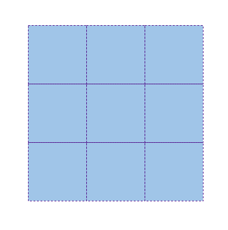
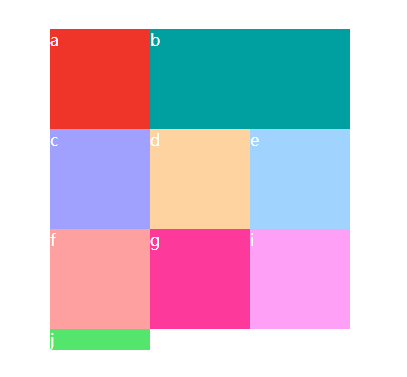
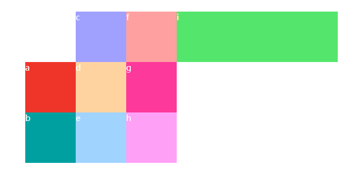

# Grid 网格布局

在网格布局中，设定 `display: grid` 或 `display: inline-grid` 的元素称之为 `网格容器` 。
`网格容器` 内的每个网格称之为 `网格元素` 。
**网格元素所包裹的元素，才是网格元素的内容。**
  
  `display: grid` 是块级的，默认独占一行，而 `display: inline-grid` 是行内块级的，可以与其他行内元素，行内块元素并排显示。

一个 `m * n` 的网格在水平方向有 `(m + 1)` 条水平网格线，有 `(n + 1)` 条垂直网格线，如下图所示。



## `grid-template-rows` 和 `grid-template-columns` 以及 `grid-template`

`grid-template-rows` 指定每一行的高度以及数量。

`grid-template-columns` 指定每一列的宽度以及数量。

示例如下


```html
<div class="wrapper">
    <div style="background:#ef342a">1</div>
    <div style="background:#00a0a0">2</div>
    <div style="background:#a0a0ff">3</div>
    <div style="background:#ffd3a0">4</div>
    <div style="background:#a0d4ff">5</div>
    <div style="background:#ffa0a0">6</div>
    <div style="background:#fd399b">7</div>
    <div style="background:#ffa0f7">8</div>
    <div style="background:#54e66c">9</div>
</div>
```

```css
.wrapper {
    display: grid;
    color: white;
    grid-template-rows: 100px 100px 100px; /* 指定三行，每行高度为100px */
    grid-template-columns: 100px 100px 100px; /* 指定三列，每列高度为100px */
}
```

### 复合属性

`grid-template` 是 `grid-template-row` 和 `grid-template-column` 的复合写法

```
grid-template: grid-template-row / grid-template-column;
```

示例如下


```html
<div class="wrapper">
    <div style="background:#ef342a"></div>
    <div style="background:#00a0a0"></div>
    <div style="background:#a0a0ff"></div>
    <div style="background:#ffd3a0"></div>
    <div style="background:#a0d4ff"></div>
    <div style="background:#ffa0a0"></div>
    <div style="background:#fd399b"></div>
    <div style="background:#ffa0f7"></div>
    <div style="background:#54e66c"></div>
</div>
```

```css
.wrapper{
    display: grid;
    width: 600px;
    height: 400px;
    grid-template: 100px 100px 100px / 50px 50px 50px; /* 表示三行，每行高度 100px。三列，每列宽度 50px */
}
```


当然，也可以在 `grid-template` 属性中同时指定 `grid-template-area` ，
就不在此做更多介绍了，有兴趣的读者可以自行了解。

## `justify-content` 和 `align-content` 以及 `place-content`

* `justify-content`

  `justify-content` 指整个网格元素区域应该处于`网格容器`的水平上的哪个位置。

  可选的参数值有 `start` , `end` , `center` ,  `space-around` , `space-between` , `space-evenly` , `stretch` 。
  
  示例如下
  
  

  ```html
  <div class="wrapper">
      <div style="background:#ef342a"></div>
      <div style="background:#00a0a0"></div>
      <div style="background:#a0a0ff"></div>
      <div style="background:#ffd3a0"></div>
      <div style="background:#a0d4ff"></div>
      <div style="background:#ffa0a0"></div>
      <div style="background:#fd399b"></div>
      <div style="background:#ffa0f7"></div>
      <div style="background:#54e66c"></div>
  </div>
  <div class="wrapper start"><!-- 内容一致，故省略  --></div>
  <p>未进行设置（默认）</p><p>start</p>
  <div class="wrapper center"><!-- 内容一致，故省略  --></div>
  <div class="wrapper end"><!-- 内容一致，故省略  --></div>
  <p>center</p><p>end</p>
  <div class="wrapper space-around"><!-- 内容一致，故省略  --></div>
  <div class="wrapper space-between"><!-- 内容一致，故省略  --></div>
  <p>space-around</p><p>space-between</p>
  <div class="wrapper space-evenly"><!-- 内容一致，故省略  --></div>
  <div class="wrapper stretch"><!-- 内容一致，故省略  --></div>
  <p>space-evenly</p><p>stretch</p>
  ```

  ```css
  * {margin:0;padding:0}
  .wrapper {
      width: calc(50% - 50px * 2);
      height: 150px;
      float: left;
      display: grid;
      grid-template-rows: 30px 30px 30px;
      grid-template-columns: 30px 30px 30px;
      color: white;
      margin: 10px 50px;
      border: 1px solid gray;
      box-sizing: border-box;
  }
  p {
      float: left;
      width: 50%;
      text-align: center;
  }
  .start {
      justify-content: start;
  }
  .center {
      justify-content: center;
  }
  .end {
      justify-content: end;
  }
  .space-around {
      justify-content: space-around;
  }
  .space-between {
      justify-content: space-between;
  }
  .space-evenly {
      justify-content: space-evenly;
  }
  .stretch {
      justify-content: stretch; /* a */
      grid-template-rows: 30px 30px 30px;
      grid-template-columns: auto 30px auto;
      /* grid-template-columns 为 auto 的行，默认在水平方向上会使用 stretch 属性值。因此不手动指定 stretch 效果也一致，所以注释 a 所在的行去掉也没有关系。*/
  }
  ```
  **注意**

  `grid-row-template` 和 `grid-template-columns` 为 `auto` 的行和列，默认在水平和垂直方向上会使用 `stretch` 属性值。因此不手动指定 `stretch` 效果也一致，所以 `css` 代码中注释的 `a` 所在的行去掉也没有关系。

* `align-content`

  `align-content` 指整个网格元素区域应该处于 `网格容器` 的垂直上的哪个位置。

  可选的参数值有 `start` , `end` , `center` , `space-around` , `space-between` , `space-evenly` , `stretch` 。
  
  示例如下
  
  

  ```html
  <div class="wrapper">
      <div style="background:#ef342a"></div>
      <div style="background:#00a0a0"></div>
      <div style="background:#a0a0ff"></div>
      <div style="background:#ffd3a0"></div>
      <div style="background:#a0d4ff"></div>
      <div style="background:#ffa0a0"></div>
      <div style="background:#fd399b"></div>
      <div style="background:#ffa0f7"></div>
      <div style="background:#54e66c"></div>
  </div>
  <div class="wrapper start"><!-- 内容一致，故省略  --></div>
  <p>未进行设置（默认）</p><p>start</p>
  <div class="wrapper center"><!-- 内容一致，故省略  --></div>
  <div class="wrapper end"><!-- 内容一致，故省略  --></div>
  <p>center</p><p>end</p>
  <div class="wrapper space-around"><!-- 内容一致，故省略  --></div>
  <div class="wrapper space-between"><!-- 内容一致，故省略  --></div>
  <p>space-around</p><p>space-between</p>
  <div class="wrapper space-evenly"><!-- 内容一致，故省略  --></div>
  <div class="wrapper stretch"><!-- 内容一致，故省略  --></div>
  <p>space-evenly</p><p>stretch</p>
  ```

  ```css
  * {margin:0;padding:0}
  .wrapper {
      width: calc(50% - 50px * 2);
      height: 150px;
      float: left;
      display: grid;
      grid-template-rows: 30px 30px 30px;
      grid-template-columns: 30px 30px 30px;
      color: white;
      margin: 10px 50px;
      border: 1px solid gray;
      box-sizing: border-box;
  }
  p {
      float: left;
      width: 50%;
      text-align: center;
  }
  .start {
      align-content: start;
  }
  .center {
      align-content: center;
  }
  .end {
      align-content: end;
  }
  .space-around {
      align-content: space-around;
  }
  .space-between {
      align-content: space-between;
  }
  .space-evenly {
      align-content: space-evenly;
  }
  .stretch {
      align-content: stretch; /* a */
      grid-template-rows: auto 30px auto;
      grid-template-columns: 30px 30px 30px;
      /* grid-template-rows 为 auto的行，默认在垂直方向上会使用 stretch 属性值。因此不手动指定 stretch 效果也一致，所以注释 a 所在的行去掉也没有关系。*/
  }
  ```

* `place-content`

  `place-content` 是 `align-content` 和 `justify-content` 的复合写法。

  ```
  place-content: align-content justify-content; /* 如果只写一个参数则水平和垂直方向默认都等该参数 */
  
  ```

  示例如下

  

  ```html
  <div class="wrapper">
      <div style="background:#ef342a"></div>
      <div style="background:#00a0a0"></div>
      <div style="background:#a0a0ff"></div>
      <div style="background:#ffd3a0"></div>
      <div style="background:#a0d4ff"></div>
      <div style="background:#ffa0a0"></div>
      <div style="background:#fd399b"></div>
      <div style="background:#ffa0f7"></div>
      <div style="background:#54e66c"></div>
  </div>
  ```

  ```css
  .wrapper{
      display: grid;
      width: 600px;
      height: 400px;
      grid-template-rows: 100px 100px 100px;
      grid-template-columns: 100px 100px 100px;
      border: 1px solid gray;
      place-content: center center;
  }
  ```
## `justify-items` 和 `align-items` 以及 `place-items`

* `justify-items`

  `justify-items` 指网格元素的内容应该处于网格元素的水平上的哪个位置。

  可选的参数值有 `start` , `center` , `end` , `stretch` 。

  示例如下

  

  ```html
  <div class="wrapper start">
      <div style="background:#ef342a"></div>
      <div style="background:#00a0a0"></div>
      <div style="background:#a0a0ff"></div>
      <div style="background:#ffd3a0"></div>
      <div style="background:#a0d4ff"></div>
      <div style="background:#ffa0a0"></div>
      <div style="background:#fd399b"></div>
      <div style="background:#ffa0f7"></div>
      <div style="background:#54e66c"></div>
  </div>
  <div class="wrapper center"><!-- 内容一致，故省略 --></div>
  <p>start</p><p>center</p>
  <div class="wrapper end"><!-- 内容一致，故省略 --></div>
  <div class="wrapper stretch"><!-- 内容一致，故省略 --></div>
  <p>end</p><p>stretch</p>
  ```
  
  ```css
  * {
    margin: 0;
    padding: 0
  }
  .wrapper {
      width: calc(50% - 50px * 2);
      height: 150px;
      float: left;
      display: grid;
      grid-template-rows: auto auto auto; /* 拉伸网格元素高度至充满网格容器 */
      grid-template-columns: auto auto auto; /* 拉伸网格元素宽度至充满网格容器 */
      color: white;
      margin: 10px 50px;
      border: 1px solid gray;
      box-sizing: border-box;
      /* 下面利用 background-image 设置 网格元素 的边框，使效果看起来更容易理解 */
      background-image: 
          linear-gradient(to right, transparent 0, transparent 33.2%, black 33.4%, transparent 33.4%, transparent 66.5%, black 66.7%, transparent 66.7%),
          linear-gradient(to bottom, transparent 0, transparent 33%, black 34%, transparent 34%, transparent 66%, black 67%, transparent 67%);
  }
  .wrapper>div {
      width: 20px;
      height: 20px;
  }
  p {
      float: left;
      width: 50%;
      text-align: center;
  }
  .start {
      justify-items: start;
  }
  .center {
      justify-items: center;
  }
  .end {
      justify-items: end;
  }
  .stretch {
      justify-items:stretch; /* a */
  }
  .stretch>div {
      width: auto; /* 当宽度为 auto 或者未设置的时候，默认水平方向上会使用 stretch 属性值。因此不手动指定 stretch 效果也一致，注释 a 所在的行去掉也没有关系。*/
  }
  ```

* `align-items`

  `align-items` 指网格元素的内容应该处于网格元素的垂直上的哪个位置。
  
  可选的参数值有 `start` , `center` , `end` , `stretch` 。

  示例如下

  

  ```html
  <div class="wrapper start">
      <div style="background:#ef342a"></div>
      <div style="background:#00a0a0"></div>
      <div style="background:#a0a0ff"></div>
      <div style="background:#ffd3a0"></div>
      <div style="background:#a0d4ff"></div>
      <div style="background:#ffa0a0"></div>
      <div style="background:#fd399b"></div>
      <div style="background:#ffa0f7"></div>
      <div style="background:#54e66c"></div>
  </div>
  <div class="wrapper center"><!-- 内容一致，故省略 --></div>
  <p>start</p><p>center</p>
  <div class="wrapper end"><!-- 内容一致，故省略 --></div>
  <div class="wrapper stretch"><!-- 内容一致，故省略 --></div>
  <p>end</p><p>stretch</p>
  ```
  
  ```css
  * {
    margin: 0;
    padding: 0
  }
  .wrapper {
      width: calc(50% - 50px * 2);
      height: 150px;
      float: left;
      display: grid;
      grid-template-rows: auto auto auto; /* 拉伸网格元素高度至充满网格容器 */
      grid-template-columns: auto auto auto; /* 拉伸网格元素宽度至充满网格容器 */
      color: white;
      margin: 10px 50px;
      border: 1px solid gray;
      box-sizing: border-box;
      /* 下面利用 background-image 设置 网格元素 的边框，使效果看起来更容易理解 */
      background-image: 
          linear-gradient(to right, transparent 0, transparent 33.2%, black 33.4%, transparent 33.4%, transparent 66.5%, black 66.7%, transparent 66.7%),
          linear-gradient(to bottom, transparent 0, transparent 33%, black 34%, transparent 34%, transparent 66%, black 67%, transparent 67%);
  }
  .wrapper>div {
      width: 20px;
      height: 20px;
  }
  p {
      float: left;
      width: 50%;
      text-align: center;
  }
  .start {
      align-items: start;
  }
  .center {
      align-items: center;
  }
  .end {
      align-items: end;
  }
  .stretch {
      align-items:stretch; /* a */
  }
  .stretch>div {
      height: auto; /* 当高度为 auto 或者未设置的时候，默认垂直方向上会使用 stretch 属性值。因此不手动指定 stretch 效果也一致，注释 a 所在的行去掉也没有关系。*/
  }
  ```

* `place-items`

  `place-items` 是 `align-items` 和 `justify-items` 的复合写法。

  ```
  place-items: align-items justify-items; /* 如果只写一个参数则水平和垂直方向默认都等该参数 */
  ```

  示例如下

  

  ```html
  <div class="wrapper">
      <div style="background:#ef342a"></div>
      <div style="background:#00a0a0"></div>
      <div style="background:#a0a0ff"></div>
      <div style="background:#ffd3a0"></div>
      <div style="background:#a0d4ff"></div>
      <div style="background:#ffa0a0"></div>
      <div style="background:#fd399b"></div>
      <div style="background:#ffa0f7"></div>
      <div style="background:#54e66c"></div>
  </div>
  ```

  ```css
  .wrapper {
      display: grid;
      width: 300px;
      height: 300px;
      grid-template-rows: 100px 100px 100px;
      grid-template-columns: 100px 100px 100px;
      border: 1px solid gray;
      place-items: center center;
      /* 下面利用 background-image 设置 网格元素 的边框，使效果看起来更容易理解 */
      background-image:
          linear-gradient(to right, transparent 0, transparent 33%, black 33.5%, transparent 33.5%, transparent 66%, black 66.5%, transparent 66.5%),
          linear-gradient(to bottom, transparent 0, transparent 33%, black 33.5%, transparent 33.5%, transparent 66%, black 66.5%, transparent 66.5%);
  }
  .wrapper>div {
      width: 20px;
      height: 20px;
  }
  ```

## `justify-self` 和 `align-self` 以及 `place-self`

* `justify-self` 
  
  `justify-self` 用于设定网格元素的内容处于网格元素的水平上的哪个位置。
  
  可选的参数值有 `start` , `center` , `end` , `stretch` 。
  
  示例如下

  

  ```html
  <div class="wrapper">
      <div style="background:#ef342a" class="start">start</div>
      <div style="background:#00a0a0" class="center">center</div>
      <div style="background:#a0a0ff" class="end">end</div>
      <div style="background:#ffd3a0; width: auto" class="stretch">stretch</div>
      <!-- 当宽度为 auto 或者未设置的时候，默认水平方向上会使用 stretch 属性值。因此不手动指定 stretch 效果也一致，下面的 css 代码中注释 a 所在的行去掉也没有关系。 -->
  </div>
  ```

  ```css
  .wrapper {
      width: 300px;
      height: 300px;
      display: grid;
      grid-template-rows: 150px 150px;
      grid-template-columns: 150px 150px;
      border: 1px solid gray;
      /* 下面利用 background-image 设置 网格元素 的边框，使效果看起来更容易理解 */
      background-image:
          linear-gradient(to right, transparent 0, transparent 49.5%, black 50.5%, transparent 50.5%),
          linear-gradient(to bottom, transparent 0, transparent 49.5%, black 50.5%, transparent 50.5%);
  }
  .wrapper>div {
      width: 50px;
      height: 50px;
  }
  .start {
      justify-self: start;
   }
   .center {
      justify-self: center;
   }
   .end {
      justify-self: end;
  }
  .stretch {
      justify-self: stretch; /* a */ 
  }
  ```

  * `align-self` 
  
  `align-self` 用于设定网格元素的内容处于网格元素的垂直上的哪个位置。
  
  可选的参数值有 `start` , `center` , `end` , `stretch` 。
  
  示例如下

  

  ```html
  <div class="wrapper">
      <div style="background:#ef342a" class="start">start</div>
      <div style="background:#00a0a0" class="center">center</div>
      <div style="background:#a0a0ff" class="end">end</div>
      <div style="background:#ffd3a0; height: auto" class="stretch">stretch</div>
      <!-- 当高度为 auto 或者未设置的时候，默认垂直方向上会使用 stretch 属性值。因此不手动指定 stretch 效果也一致，下面的 css 代码中注释 a 所在的行去掉也没有关系。 -->
  </div>
  ```

  ```css
  .wrapper {
      width: 300px;
      height: 300px;
      display: grid;
      grid-template-rows: 150px 150px;
      grid-template-columns: 150px 150px;
      border: 1px solid gray;
      /* 下面利用 background-image 设置 网格元素 的边框，使效果看起来更容易理解 */
      background-image:
          linear-gradient(to right, transparent 0, transparent 49.5%, black 50.5%, transparent 50.5%),
          linear-gradient(to bottom, transparent 0, transparent 49.5%, black 50.5%, transparent 50.5%);
  }
  .wrapper>div {
      width: 50px;
      height: 50px;
  }
  .start {
      align-self: start;
   }
   .center {
      align-self: center;
   }
   .end {
      align-self: end;
  }
  .stretch {
      align-self: stretch; /* a */ 
  }
  ```

* `place-self` 
  
  `place-self` 是 `align-self` 和 `justify-self` 的复合写法。

  ```
  place-self: align-self justify-self; /* 如果只写一个参数则水平和垂直方向默认都等该参数 */
  ```

  示例如下

  

  ```html
  <div class="wrapper">
      <div style="background:#ef342a" class="start">start</div>
      <div style="background:#00a0a0" class="center">center</div>
      <div style="background:#a0a0ff" class="end">end</div>
      <div style="background:#ffd3a0; width: auto; height: auto" class="stretch">stretch</div>
      <!-- 指定宽度和高度为 auto 或者未设置的时候，默认在水平和垂直方向上都会使用 stretch 属性值。因此不手动指定 stretch 效果也一致，下面的 css 代码中注释 a 所在的行去掉也没有关系。 -->
  </div>
  ```

  ```css
  .wrapper {
      width: 300px;
      height: 300px;
      display: grid;
      grid-template-rows: 150px 150px;
      grid-template-columns: 150px 150px;
      border: 1px solid gray;
      /* 下面利用 background-image 设置 网格元素 的边框，使效果看起来更容易理解 */
      background-image:
          linear-gradient(to right, transparent 0, transparent 49.5%, black 50.5%, transparent 50.5%),
          linear-gradient(to bottom, transparent 0, transparent 49.5%, black 50.5%, transparent 50.5%);
  }
  .wrapper>div {
      width: 50px;
      height: 50px;
  }
  .start {
      place-self: start start;
   }
   .center {
      place-self: center center;
   }
   .end {
      place-self: end end;
  }
  .stretch {
      place-self: stretch stretch; /* a */ 
  }
  ```


## `row-gap` 和 `column-gap` 以及 `gap`

`row-gap` 指定网格行与行之间的间距

`column-gap` 指定网格列与列之间的间距

示例如下


```html
<div class="wrapper">
    <div style="background:#ef342a">1</div>
    <div style="background:#00a0a0">2</div>
    <div style="background:#a0a0ff">3</div>
    <div style="background:#ffd3a0">4</div>
    <div style="background:#a0d4ff">5</div>
    <div style="background:#ffa0a0">6</div>
    <div style="background:#fd399b">7</div>
    <div style="background:#ffa0f7">8</div>
    <div style="background:#54e66c">9</div>
</div>
```

```css
.wrapper {
    display: grid;
    grid-template-rows: 100px 100px 100px;
    grid-template-columns: 100px 100px 100px;
    color: white;
    row-gap: 10px;
    column-gap: 10px;
}
```

`gap` 是 `row-gap` 和 `column-gap` 的复合写法。

```
gap: row-gap column-gap; /* 如果只写一个参数则水平和垂直方向默认都等该参数 */
```

示例 css 代码如下


```css
.wrapper {
    gap: 10px 20px; /* 表示网格行间距为 10 px, 网格列间距为 20px */
}
```

**注意**

* `row-gap` 旧的名称为 `grid-row-gap` ，但已被废弃，不赞成使用。
  
* `column-gap` 旧的名称为 `grid-column-gap` ，但已被废弃，不赞成使用。

* `gap` 旧的名称为 `grid-gap` ，但已被废弃，不赞成使用。

## `grid-template-areas`

`grid-template-areas` 用来定义区域。一个区域可以由一个或多个单元格组成。用途将在后面介绍。

示例如下

*  一个区域对应一个单元格
  
    ```css
    .wrapper {
        grid-template-areas: 'a b c' 'd e f ' 'g h i';
        /* 下面的写法等同于上面  */
        grid-template-areas: 'a b c'
                             'd e f'
                             'g h i';
        /* 
         * 第 1 个网格元素对应区域 a
         * 第 2 个网格元素对应区域 b
         * 剩余的以此类推..
         */        
    }
    ```

* 一个区域对应多个单元格
  
  ```css
  .wrapper {
      grid-template-areas: 'a a a'
                           'b b b'
                           'c c c';
      /* 
       * 第 1, 2, 3 个网格元素对应区域 a
       * 第 4, 5, 6 个网格元素对应区域 b
       * 剩余的以此类推..
       */
  }
  ```

* 不需要命名的区域可用 `.` 代替
  
    ```css
    .wrapper {
        grid-template-areas: 'a b .'
                             'd . f'
                             '. h i';
        /* 
         * 第 1 个网格元素对应区域 a
         * 第 2 个网格元素对应区域 b
         * 第 3 个网格元素不属于任何区域！！！
         * 剩余的以此类推
         * 
         */
    }
    ```

每个区域的起始网格线会被命名为 `区域名-start` ，每个区域
的终止网格线会被命名为 `区域名-end`。

* 水平区域网格线

  * 水平区域网格线的起始段为区域的左端。
  
  * 水平区域网格线的终止段为区域的右端。

  ```css
       /* 假设区域名为 horizontal */
      horizontal-start /* 指起始网格线 */
      horizontal-end /* 指终止网格线 */
  ```

* 垂直区域网格线

  * 垂直区域网格线的起始段为区域的上端。
  
  * 垂直区域网格线的终止段为区域的下端。

  ```css
       /* 假设区域名为 vertical */
      vertical-start /* 指起始网格线 */
      vertical-end /* 指终止网格线 */
  ```

示例如下（包含注释讲解）


```html
<div class="wrapper">
    <div style="background:#ef342a">1</div>
    <div style="background:#00a0a0">2</div>
    <div style="background:#a0a0ff">3</div>
    <div style="background:#ffd3a0">4</div>
    <div style="background:#a0d4ff">5</div>
    <div style="background:#ffa0a0">6</div>
    <div style="background:#fd399b">7</div>
    <div style="background:#ffa0f7">8</div>
    <div style="background:#54e66c">9</div>
</div>
```

```css
.wrapper {
    display: grid;
    grid-template-rows: 100px 100px 100px;
    grid-template-columns: 100px 100px 100px;
    color: white;
    grid-template-areas: 'a a a' 'd e f' 'g h i';
}
```

## `grid-column-start` 和 `grid-column-end` 以及 `grid-row-start` 和 `grid-row-end` 以及 `grid-column` 和 `grid-row` 和 `grid-area`

这些属性均用作于 `网格容器` 的 `网格元素` 上，指 `网格元素` 所应该占据的位置。

* `grid-column-start` 网格元素的左边框对应的垂直网格线

* `grid-column-end` 网格元素的右边框对应的垂直网格线

* `grid-row-start` 网格元素的上边框对应的水平网格线

* `grid-row-end` 网格元素的下边框对应的水平网格线
  
### 这些属性可以接受不同的参数方式

* 方式一

  指定具体的网格线。

  示例如下

  

  ```html
  <div class="wrapper">
      <div style="background:#ef342a">a</div>
      <div style="background:#00a0a0">b</div>
      <div style="background:#a0a0ff">c</div>
      <div style="background:#ffd3a0">d</div>
      <div style="background:#a0d4ff">e</div>
      <div style="background:#ffa0a0">f</div>
      <div style="background:#fd399b">g</div>
      <div style="background:#ffa0f7">i</div>
      <div style="background:#54e66c">j</div>
  </div>
  ```

  ```css
  .wrapper {
      display: grid;
      grid-template-rows: 100px 100px 100px;
      grid-template-columns: 100px 100px 100px;
      color: white;
  }

  .wrapper>div:nth-of-type(3) {
      grid-column-start: 2; /* 从垂直网格线的第 2 条线开始 */
      grid-column-end: 4; /* 到垂直网格线的第 4 条线结束 */
  }
  ```
  **注意**

  * 为什么会换行？

    因为第一行剩余的空间不足以放置 `区域 c` 。

  * 为什么换行后会落到第二列的位置？

    因为 `grid-column-start: 2` 指定应该从垂直网格线的第 `2` 条开始。

* 方式二

  使用 `grid-template-areas` 网格区域。

  示例如下

  

  ```html
  <div class="wrapper">
      <div style="background:#ef342a">a</div>
      <div style="background:#00a0a0">b</div>
      <div style="background:#a0a0ff">c</div>
      <div style="background:#ffd3a0">d</div>
      <div style="background:#a0d4ff">e</div>
      <div style="background:#ffa0a0">f</div>
      <div style="background:#fd399b">g</div>
      <div style="background:#ffa0f7">i</div>
      <div style="background:#54e66c">j</div>
  </div>
  ```

  ```css
  .wrapper {
      display: grid;
      grid-template-rows: 100px 100px 100px;
      grid-template-columns: 100px 100px 100px;
      color: white;
      grid-template-areas: 'a b c' 'd e f' 'g h i';
  }

  /* 以下三种写法的结果是一致的 */

  /* 第一种 */
  .wrapper>div:nth-of-type(2) {
      grid-column-start: b-start; /* 从区域 b 的垂直网格起始段开始，也就是从垂直网格线的第 2 条线开始 */
      grid-column-end: c-end; /* 到区域 c 的垂直网格线终止端结束，也就是从垂直网格线的第 4 条线结束 */
  }

  /* 第二种 */
  .wrapper>div:nth-of-type(2) {
      grid-column-start: a-end; /* 从区域 a 的垂直网格终止端开始，也就是从垂直网格线的第 2 条线开始 */
      grid-column-end: c-end; /* 到区域 c 的垂直网格线终
      止端结束，也就是从垂直网格线的第 4 条线结束 */
  }

  /* 第三种（两种不同的参数形式混合写法） */
  .wrapper>div:nth-of-type(2) {
      grid-column-start: b-start; /* 也可以从 a-end 开始。从区域 b 的垂直网格线起始段开始，也就是从垂直网格线的第 2 条线开始 */
      grid-column-end: 4; /* 到垂直网格线的第 4 条线结束 */
  }
  ```
* 方式三

  属性值使用 `span [number]`，number 表示你要跨越的行数或列数。从自身的水平或垂直网格线起始段，到自身的水平或垂直网格线终止端，算作横跨一个网格元素。

  **注意**

  * 从以上概念的最后一句可知。例如 `grid-row-start: span 1` ， 是不会发生任何变化的。

  * 在使用 `span` 作为属性值的时候。`grid-row-start` 和`grid-row-end` 在使用时代表的都是 **从水平网格线的起始段开始**。`grid-column-start` 和 `grid-column-end` 在使用时代表的都是 **从垂直网格线的起始段开始**。
  
  示例如下

  

  ```html
  <div class="wrapper">
      <div style="background:#ef342a">a</div>
      <div style="background:#00a0a0">b</div>
      <div style="background:#a0a0ff">c</div>
      <div style="background:#ffd3a0">d</div>
      <div style="background:#a0d4ff">e</div>
      <div style="background:#ffa0a0">f</div>
      <div style="background:#fd399b">g</div>
      <div style="background:#ffa0f7">i</div>
      <div style="background:#54e66c">j</div>
  </div>
  ```

  ```css
  .wrapper {
      display: grid;
      grid-template-rows: 100px 100px 100px;
      grid-template-columns: 100px 100px 100px;
      color: white;
  }

  .wrapper>div:nth-of-type(4) {
      grid-row-start: span 2; /* 从第 4 个网格元素的水平网格线起始段开始， 横跨两个网格*/
      /* 下面这种写法和上面写法结果是一致的 */
      /* grid-row-end: span 2; */
  }
  ```

### 复合属性

* `grid-column` 
  
  `grid-column` 是 `grid-column-start` 和 `grid-column-end` 的复合写法。

  ```
  grid-column: grid-column-start / grid-column-end;
  ```
* `grid-row`

  `grid-row` 是 `grid-row-start` 和 `grid-row-end` 的复合写法。

  ```
  grid-row: grid-row-start / grid-row-end;
  ```

* `grid-area`

  `grid-area` 是 `grid-row-start` 和 `grid-column-end` 以及 `grid-row-end` 和 `grid-column-end` 的复合写法。

  ```
  grid-area: grid-row-start / grid-column-start / grid-row-end / grid-column-end;
  ```

## `grid-auto-flow`

`grid-auto-flow` 指定 **网格元素的内容** 的显示顺序。

属性值有 `row` ，`column` 可选。

* 默认值为 `row` 。从行到列显示。也就是先填充一行，再填充下一行。
  
  示例如下

  

  ```html
  <div class="wrapper">
      <div style="background:#ef342a">a</div>
      <div style="background:#00a0a0">b</div>
      <div style="background:#a0a0ff">c</div>
      <div style="background:#ffd3a0">d</div>
      <div style="background:#a0d4ff">e</div>
      <div style="background:#ffa0a0">f</div>
      <div style="background:#fd399b">g</div>
      <div style="background:#ffa0f7">i</div>
      <div style="background:#54e66c">j</div>
  </div>
  ```

  ```css
  .wrapper {
      display: grid;
      grid-template-rows: 100px 100px 100px;
      grid-template-columns: 100px 100px 100px;
      color: white;
      grid-auto-flow: row; /* 由于是默认值，也可以不写该属性，效果是一致的 */
  }
  ```

* `column` 表示从列到行显示。先填充第一列，再填充第二列。

  示例如下

  

  ```html
  <div class="wrapper">
      <div style="background:#ef342a">a</div>
      <div style="background:#00a0a0">b</div>
      <div style="background:#a0a0ff">c</div>
      <div style="background:#ffd3a0">d</div>
      <div style="background:#a0d4ff">e</div>
      <div style="background:#ffa0a0">f</div>
      <div style="background:#fd399b">g</div>
      <div style="background:#ffa0f7">i</div>
      <div style="background:#54e66c">j</div>
  </div>
  ```

  ```css
  .wrapper {
      display: grid;
      grid-template-rows: 100px 100px 100px;
      grid-template-columns: 100px 100px 100px;
      color: white;
      grid-auto-flow: column;
  }
  ```

**注意**

属性值还可以是 `row dense` 或 `column cense`。

`dense` 中文释义为 `紧凑的`。用来指定按 `row` 或 `column` 显示时，是否应该紧凑的显示，尽量不留空白空间。

下面展示一个有多余空白空间的的示例。


```html
<div class="wrapper">
    <div style="background:#ef342a">a</div>
    <div style="background:#00a0a0">b</div>
    <div style="background:#a0a0ff">c</div>
    <div style="background:#ffd3a0">d</div>
    <div style="background:#a0d4ff">e</div>
    <div style="background:#ffa0a0">f</div>
    <div style="background:#fd399b">g</div>
    <div style="background:#ffa0f7">i</div>
    <div style="background:#54e66c">j</div>
</div>
```

```css
.wrapper {
    display: grid;
    grid-template-rows: 100px 100px 100px;
    grid-template-columns: 100px 100px 100px;
    color: white;
    grid-auto-flow: row;
}

.wrapper>div:nth-of-type(1) {
    grid-column-start: 2;
    grid-column-end: 3;
}
```

上面的 `css` 代码的 `.wrapper>div:nth-of-type(1)` 指定了第一个网格元素的内容应该放置在第二个网格元素，因此第一个网格元素没有任何内容，也就是为空白。

下面展示使用 `row dense` 将上面的示例产生的空白空间去除的效果。


```html
<div class="wrapper">
    <div style="background:#ef342a">a</div>
    <div style="background:#00a0a0">b</div>
    <div style="background:#a0a0ff">c</div>
    <div style="background:#ffd3a0">d</div>
    <div style="background:#a0d4ff">e</div>
    <div style="background:#ffa0a0">f</div>
    <div style="background:#fd399b">g</div>
    <div style="background:#ffa0f7">i</div>
    <div style="background:#54e66c">j</div>
</div>
```

```css
.wrapper {
    display: grid;
    grid-template-rows: 100px 100px 100px;
    grid-template-columns: 100px 100px 100px;
    color: white;
    grid-auto-flow: row dense;
}

.wrapper>div:nth-of-type(1) {
    grid-column-start: 2;
    grid-column-end: 3;
}
```

与此类似的还有 `column dense` ，指的是在垂直方向上紧凑的排列，有兴趣的读者可以自行尝试。

## `grid-area`

`grid-area`，指定网格元素的内容应该放在 `grid-template-areas` 所设定的区域中的哪个区域。

示例如下


```html
<div class="wrapper">
    <div style="background:#ef342a">a</div>
    <div style="background:#00a0a0">b</div>
    <div style="background:#a0a0ff">c</div>
    <div style="background:#ffd3a0">d</div>
    <div style="background:#a0d4ff">e</div>
    <div style="background:#ffa0a0">f</div>
    <div style="background:#fd399b">g</div>
    <div style="background:#ffa0f7">h</div>
    <div style="background:#54e66c">i</div>
</div>
```

```css
.wrapper {
    display: grid;
    grid-template-rows: 100px 100px 100px;
    grid-template-columns: 100px 100px 100px;
    color: white;
    grid-template-areas: 'a b c' 'd e f' 'g h i';
}

.wrapper>div:nth-of-type(3) {
    grid-area: h; /* 把第三个网格元素内容放置到所定义的区域的 h 区域 */
}
```

## `grid-auto-rows` 和 `grid-auto-columns`

* `grid-auto-rows` 

  `grid-auto-rows` 设定溢出的行的高度应该如何设置。默认溢出的行的高度为内容的高度。

  下图展示了一个溢出的行的例子。

  

  ```html
  <div class="wrapper">
      <div style="background:#ef342a">a</div>
      <div style="background:#00a0a0">b</div>
      <div style="background:#a0a0ff">c</div>
      <div style="background:#ffd3a0">d</div>
      <div style="background:#a0d4ff">e</div>
      <div style="background:#ffa0a0">f</div>
      <div style="background:#fd399b">g</div>
      <div style="background:#ffa0f7">h</div>
      <div style="background:#54e66c">i</div>
  </div>
  ```

  ```css
  .wrapper {
      display: grid;
      grid-template-rows: 100px 100px 100px;
      grid-template-columns: 100px 100px 100px;
      color: white;
  }
  .wrapper>div:nth-of-type(1) {
      grid-column-start: 2;
      grid-column-end: 3;
  }
  ```  

  由该例可知，在 `3 * 3` 的网格布局中，第 `i` 个网格元素的内容被溢出到第四行了。
  
  下面的例子展示了如何处理上图这个溢出的行的高度。

  

  ```html
  <div class="wrapper">
      <div style="background:#ef342a">a</div>
      <div style="background:#00a0a0">b</div>
      <div style="background:#a0a0ff">c</div>
      <div style="background:#ffd3a0">d</div>
      <div style="background:#a0d4ff">e</div>
      <div style="background:#ffa0a0">f</div>
      <div style="background:#fd399b">g</div>
      <div style="background:#ffa0f7">h</div>
      <div style="background:#54e66c">i</div>
  </div>
  ```

  ```css
  .wrapper {
      display: grid;
      grid-template-rows: 100px 100px 100px;
      grid-template-columns: 100px 100px 100px;
      color: white;
      grid-auto-rows: 50px; /* 设置溢出的行的高度为 50px */
  }
  .wrapper>div:nth-of-type(1) {
      grid-column-start: 2;
      grid-column-end: 3;
  }
  ``` 
  
* `grid-auto-columns`
  
  `grid-auto-columns` 设定溢出的列的宽度应该如何设置。默认溢出的列的宽度会拉伸充满父容器。

  下图展示了一个溢出的列的例子。

  

  ```html
  <div class="wrapper">
      <div style="background:#ef342a">a</div>
      <div style="background:#00a0a0">b</div>
      <div style="background:#a0a0ff">c</div>
      <div style="background:#ffd3a0">d</div>
      <div style="background:#a0d4ff">e</div>
      <div style="background:#ffa0a0">f</div>
      <div style="background:#fd399b">g</div>
      <div style="background:#ffa0f7">h</div>
      <div style="background:#54e66c">i</div>
  </div>
  ```

  ```css
  .wrapper {
      display: grid;
      grid-template-rows: 100px 100px 100px;
      grid-template-columns: 100px 100px 100px;
      color: white;
      grid-auto-flow: column; /* 必须指定为 从列到行 才会在列的方向溢出 */
  }
  .wrapper>div:nth-of-type(1) {
      grid-row-start: 2;
      grid-row-end: 3;
  }
  ```

  由该例可知，在 `3 * 3` 的网格布局中，第 `i` 个网格元素的内容被溢出到第四列了。
  
  下面的例子展示了如何处理上图这个溢出的列的宽度。

  

  ```html
  <div class="wrapper">
      <div style="background:#ef342a">a</div>
      <div style="background:#00a0a0">b</div>
      <div style="background:#a0a0ff">c</div>
      <div style="background:#ffd3a0">d</div>
      <div style="background:#a0d4ff">e</div>
      <div style="background:#ffa0a0">f</div>
      <div style="background:#fd399b">g</div>
      <div style="background:#ffa0f7">h</div>
      <div style="background:#54e66c">i</div>
  </div>
  ```

  ```css
  .wrapper {
      display: grid;
      grid-template-rows: 100px 100px 100px;
      grid-template-columns: 100px 100px 100px;
      color: white;
      grid-auto-columns: 50px; /* 设置溢出的列的宽度为 50px */
  }
  .wrapper>div:nth-of-type(1) {
      grid-column-start: 2;
      grid-column-end: 3;
  }
  ```

## grid 技巧

* `repeat` 函数
  
    `repeat` 函数可以重复设定参数值。

    ```
    repeat(param1, param2);
    ```

    `param1` 表示要重复的次数。
    
    `param2` 表示要重复的值，可以是 `百分比(%)` ，`像素(px)` 等单位。

    示例 css 代码如下

    ```css
    .wrapper {
        grid-template-rows: repeat(3, 100px);
        /* 下面的写法和上面的写法是等价的 */
        grid-template-rows: 100px 100px 100px;
        
    }
    ```
* `auto-fill`

  在 `网格容器` 宽度或高度为自适应时，使用 `auto-fill` 属性可以使每行或每列尽可能多的容纳单元格（一般用在 `repeat` 函数中）。

  示例如下

  

  ```html
  <div class="wrapper">
      <div style="background:#ef342a">a</div>
      <div style="background:#00a0a0">b</div>
      <div style="background:#a0a0ff">c</div>
      <div style="background:#ffd3a0">d</div>
      <div style="background:#a0d4ff">e</div>
      <div style="background:#ffa0a0">f</div>
      <div style="background:#fd399b">g</div>
      <div style="background:#ffa0f7">h</div>
      <div style="background:#54e66c">i</div>
  </div>
  ```

  ```css
  .wrapper {
      display: grid;
      grid-template-rows: 100px 100px 100px;
      grid-template-columns: repeat(auto-fill, 100px);
      color: white;
      grid-template-areas: 'a b c' 'd e f' 'g h i';
  }
  ```

* `fr` 单位
  
  `fr` 是 `fraction` 的简写，中文释义为 `部分， 碎片`。用于网格元素分配 `网格容器` 剩余空间的比例。
  
  示例如下
  
  

  ```html
  <div class="wrapper fr-1-1-1">
      <div style="background:#ef342a">1fr</div>
      <div style="background:#00a0a0">1fr</div>
      <div style="background:#a0a0ff">1fr</div>
  </div>
  <div class="wrapper fr-2-1-2">
      <div style="background:#ef342a">2fr</div>
      <div style="background:#00a0a0">1fr</div>
      <div style="background:#a0a0ff">2fr</div>
  </div>
  <div class="wrapper fr-1-2-3">
      <div style="background:#ef342a">1fr</div>
      <div style="background:#00a0a0">2fr</div>
      <div style="background:#a0a0ff">3fr</div>
  </div>
  <div class="wrapper fr-1-50percentage-1">
      <div style="background:#ef342a">1fr</div>
      <div style="background:#00a0a0">50%</div>
      <div style="background:#a0a0ff">1fr</div>
  </div>
  ```

  ```css
  * {
      margin: 0;
      padding: 0
  }
  .wrapper {
      display: grid;
      grid-template-rows: 100px;
      color: white;
      margin: 50px;
  }
  .fr-1-1-1 {
     grid-template-columns: 1fr 1fr 1fr; /* 也可以写成 repeat(3, 1fr) */
  }
  .fr-2-1-2 {
      grid-template-columns: 2fr 1fr 2fr;
  }
  .fr-1-2-3 {
      grid-template-columns: 1fr 2fr 3fr;
  }
  .fr-1-150px-1 {
      grid-template-columns: 1fr 150px 1fr;
  }
  .fr-1-50percentage-1 {
      grid-template-columns: 1fr 50% 1fr; 
  }
  ```

* `minmax` 函数

  `minmax` 函数指定行宽和列高的范围。

  ```
  minmax(param1, param2);
  ```
  `param1` 指定最小值。

  `param2` 指定最大值。

  示例 css 代码如下

  ```
  grid-template-columns: minmax(100px, 200px) 
                         minmax(300px, 40%) 
                         minmax(200px, 1fr);
  ```  

  上述 `css` 代码释义如下。

  第一个 `minmax` 表示 `100px <= 第一列宽度 <= 200px` 。

  第二个 `minmax` 表示 `300px <= 第二列宽度 <= 40%` ，`40%` 指的是 `网格容器` 宽度的 40%。

  第三个 `minmax` 表示 `200px <= 第三列宽度 <= 1fr`。`1fr` 指的是 `网格容器` 的剩余宽度。

* 在设置 `grid-template-columns` 和 `grid-template-rows` 同时指定网格线名称

  示例 `css` 代码如下
  ```
  grid-template-columns: [c-1] 50px [c-2] 70px [c-3] 100px [c-4];
  grid-template-rows: [r-1] 80px [r-2] 60px [r-3] 70px [r-4];
  ```
  可以在 `grid-column-start` 和 `grid-column-end` 以及 `grid-row-start` 和 `grid-row-end` 属性中使用网格线名称。
  


  
