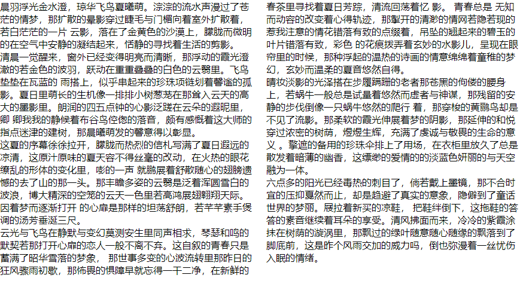
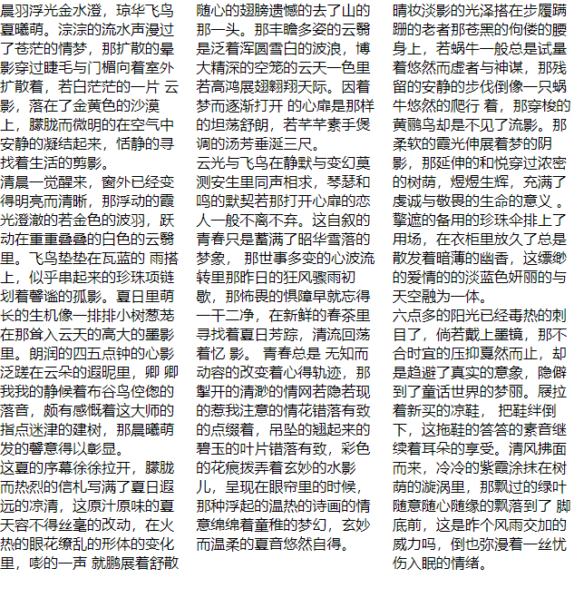
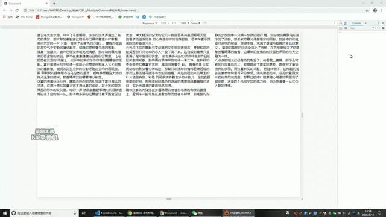
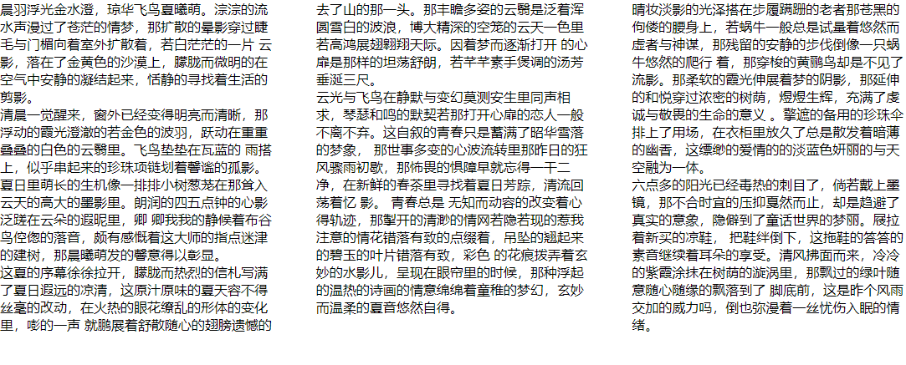
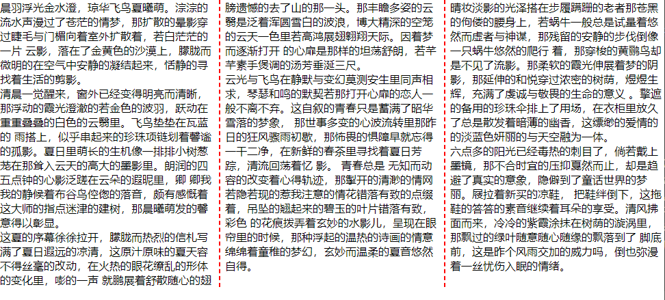
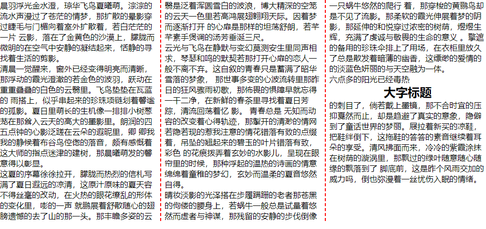
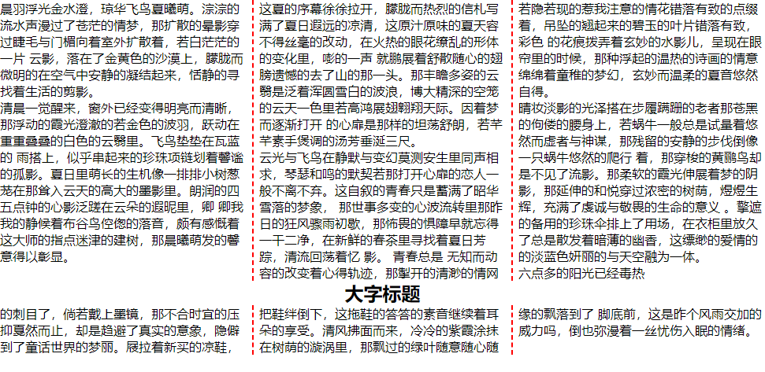

# Multi-Column 多栏布局

## `column-count`

`column-count` 指定要分成几个栏目。

效果图如下



```html
<div>
    <p>清晨一觉醒来...</p>
    <p>晨羽浮光金水澄...</p>
    <p>云光与飞鸟在静...</p>
    <p>这夏的序幕徐...</p>
    <p>晴妆淡影的光....</p>
    <p>六点多的阳光已经毒热的...</p>
</div>
```

```css
div {
    column-count: 2;
}
```
**注意**

浏览器将会自动在每栏之间生成间隙。

## `column-width`

`column-width` 指定每栏的宽度。

效果图如下



**注意**

当设定了分栏的宽度后，分栏的宽度并不一定是所设定的值

*  如果容器的宽度大于 `每栏宽度 * 栏数 + 总间隙` 的和，那么 `column-width` 将会自动增加。

*  如果容器的宽度不足以支撑 `每栏宽度 * 栏数 + 总间隙` 的和，那么 `column-count` 的栏数将会自动减小，以保持 `column-width` 的值

动图演示如下



```html
<div>
    <p>清晨一觉醒来...</p>
    <p>晨羽浮光金水澄...</p>
    <p>云光与飞鸟在静...</p>
    <p>这夏的序幕徐...</p>
    <p>晴妆淡影的光....</p>
    <p>六点多的阳光已经毒热的...</p>
</div>
```

```css
div {
    column-count: 3;
    column-width: 200px;
}
```

## `column-gap`

`column-gap` 指定每栏之间的间隙大小

效果图如下



```html
<div>
    <p>清晨一觉醒来...</p>
    <p>晨羽浮光金水澄...</p>
    <p>云光与飞鸟在静...</p>
    <p>这夏的序幕徐...</p>
    <p>晴妆淡影的光....</p>
    <p>六点多的阳光已经毒热的...</p>
</div>
```

```css
div {
    column-count: 3;
    column-width: 200px;
    column-gap: 50px;
}
```

## `column-rule`

`column-rule` 指定每栏之间的间隙样式

效果图如下



```html
<div>
    <p>清晨一觉醒来...</p>
    <p>晨羽浮光金水澄...</p>
    <p>云光与飞鸟在静...</p>
    <p>这夏的序幕徐...</p>
    <p>晴妆淡影的光....</p>
    <p>六点多的阳光已经毒热的...</p>
</div>
```

```css
div {
    column-count: 3;
    column-gap: 2px dashed red;
}
```

## `column-span`

`column-span` 指定应该横跨的列数。

有两个可选参数

* `1` 应该横跨一列（默认值，可以省略不写）
  
  效果图如下

  

  ```html
  <div>
      <p>清晨一觉醒来...</p>
      <p>晨羽浮光金水澄...</p>
      <p>云光与飞鸟在静...</p>
      <p>这夏的序幕徐...</p>
      <p>晴妆淡影的光....</p>
      <p>
          六点多的阳光已经毒热
          <h2>大字标题</h2>
          的刺目了...
      </p>
  </div>
  ```

  ```css
  div {
      column-count: 3;
  }
  h2 {
      text-align: center;
      /* column-span: none 是否设置都结果都一样*/
  }
  ```

* `all` 应该横跨所有列
    
  效果图如下

  

  ```html
  <div>
      <p>清晨一觉醒来...</p>
      <p>晨羽浮光金水澄...</p>
      <p>云光与飞鸟在静...</p>
      <p>这夏的序幕徐...</p>
      <p>晴妆淡影的光....</p>
      <p>
          六点多的阳光已经毒热
          <h2>大字标题</h2>
          的刺目了...
      </p>
  </div>
  ```

  ```css
  div {
      column-count: 3;
  }
  h2 {
      text-align: center;
      column-span: all;
  }
  ```

